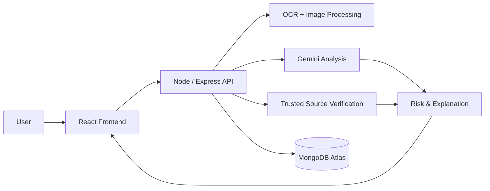
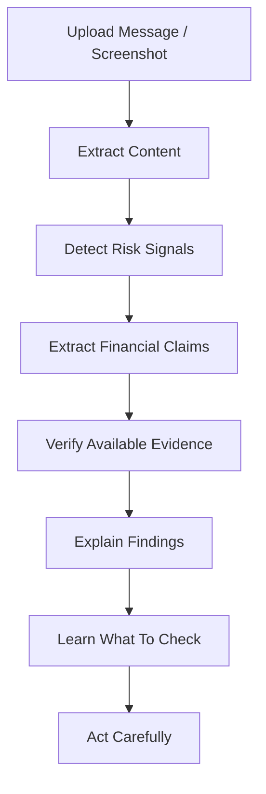

# InvestorShield AI

**Bharat-first AI-powered investor safety platform**

> **Detect. Verify. Understand. Invest Safer.**

InvestorShield AI helps everyday investors and users identify suspicious investment messages, extract financial claims from screenshots, and verify them against official, trusted sources. By focusing on simple language and actionable safe habits, it bridges the gap between complex financial regulations and the end user.

InvestorShield AI helps users:
* Detect suspicious investment content.
* Extract information from screenshots.
* Identify financial risk signals.
* Verify claims using trusted sources.
* Understand why a message may be risky.
* Learn safer investor habits.
* Access information in simple language.

---

## The Problem

Investors in Bharat are increasingly targeted with deceptive messages containing:
* Guaranteed returns
* Unrealistic profit promises
* Fake regulatory/authority claims (e.g., "SEBI Approved")
* Urgency and pressure
* Suspicious links
* Payment requests
* Requests for sensitive information (e.g., OTPs, PINs)

The problem is not just detecting suspicious content, but providing actionable literacy so users understand:
> **What should I verify before I act?**

---

## The Solution

InvestorShield AI follows a systematic workflow to protect users:

```text
User Message / Screenshot
          ↓
        OCR
          ↓
   Risk Signal Detection
          ↓
    Claim Extraction
          ↓
 Trusted Source Verification
          ↓
 Evidence-Aware Result
          ↓
 Simple Explanation
          ↓
 Investor Education
          ↓
      Safer Action
```

---

## Key Features

### Scam / Risk Analysis
* Suspicious investment message analysis.
* Risk signal identification (e.g., Urgency, Guaranteed Returns).
* Financial claim extraction.

### Screenshot Analysis
* Image upload capabilities.
* Text extraction via **Tesseract.js** OCR.
* Image preprocessing using **Sharp**.

### AI Analysis
* **Gemini-powered analysis** for intelligent extraction and natural language explanations.
* Explainable risk indicators mapping to real-world scams.

### Verification
* Google Search Grounding for fetching real-time verification context.
* Trusted-source verification.

### Evidence Status
Our platform categorizes claims into four strict evidence states:
* **Verified**: Available evidence supports the claim.
* **Contradicted**: Available trusted evidence conflicts with the claim.
* **Needs Verification**: The system cannot establish sufficient evidence and recommends further checking.
* **No Evidence Found**: No relevant evidence was found through the available verification process.

> **Note: No Evidence Found ≠ False.** Lack of evidence simply means the user should exercise extreme caution and seek alternative verification.

### Investor Education (Learning Hub)
A fully functional educational repository containing:
* Real-time case-insensitive **Search**.
* **Category filtering** (e.g., High-Risk Signals, Fake Trading Apps).
* **Detailed learning pages** explaining "Why This Matters", "What to Look For", and "Safe Habits".
* **Quick Safety Checklist** for on-the-fly verification.
* Context-aware **Related Topics** recommendations.

### History / Dashboard
* A history dashboard to review past analyzed messages and screenshots.
* Detailed analysis history view with risk indicators and claims.

---

## Bharat-First Design

Designed with the Indian user in mind:
* English + Tamil support for educational content.
* Simple language focused on readability.
* Visual risk/status indicators (colors and icons) for low cognitive load.
* Accessible, responsive, and mobile-friendly interface.

---

## Safety Guardrails

**What InvestorShield AI does NOT do:**

It does NOT provide:
* Investment advice
* Stock tips
* Buy/sell recommendations
* Portfolio management
* Guaranteed financial outcomes

> **InvestorShield AI helps users understand what to verify — not what to invest in.**
> 
> **AI-generated analysis should be treated as an aid to understanding, not as definitive financial or regulatory advice.**

---

## Technology Stack

### Frontend
* **React 19**
* **Vite**
* **TypeScript**
* **Tailwind CSS v4**
* **Lucide React** (Icons)

### Backend
* **Node.js** & **Express.js**
* **TypeScript**
* **Multer** (File uploads)

### AI / OCR
* **Google Gemini API** (`@google/generative-ai`)
* **Tesseract.js** (OCR)
* **Sharp** (Image preprocessing)

### Database
* **MongoDB Atlas**
* **Mongoose**

---

## System Architecture



---

## User Flow



---

## Project Structure

```text
InvestorShield-AI/
├── client/                 # Frontend React Application
│   ├── src/
│   │   ├── components/     # Reusable UI components
│   │   ├── pages/          # Route pages (Home, Analyze, Learn, History, etc.)
│   │   ├── services/       # API integration
│   │   └── types/          # TypeScript definitions
│   └── package.json
├── server/                 # Backend Express API
│   ├── src/
│   │   ├── controllers/    # Route controllers
│   │   ├── middleware/     # Upload, rate limiting, and security middleware
│   │   ├── prompts/        # AI prompts and logic
│   │   ├── routes/         # Express routes
│   │   └── utils/          # Helpers and validation
│   └── package.json
└── README.md
```

---

## Getting Started

### Prerequisites
* Node.js (v18+)
* npm
* MongoDB Atlas Cluster (or local MongoDB)
* Google Gemini API Key

### Installation

1. **Clone the repository:**
   ```bash
   git clone https://github.com/Devprasath17/InvestorShield-AI.git
   cd InvestorShield-AI
   ```

2. **Install Backend Dependencies:**
   ```bash
   cd server
   npm install
   ```

3. **Install Frontend Dependencies:**
   ```bash
   cd ../client
   npm install
   ```

---

## Environment Variables

Create a `.env` file in the `server` directory:

```env
PORT=5000
MONGODB_URI=<your_mongodb_connection_string>
GEMINI_API_KEY=<your_gemini_api_key>
CLIENT_URL=http://localhost:5173
```

Create a `.env` file in the `client` directory:

```env
VITE_API_URL=http://localhost:5000
```

---

## Running Locally

1. **Start the Backend Server (from the `server` directory):**
   ```bash
   npm run dev
   ```
   *The server will run on `http://localhost:5000`*

2. **Start the Frontend Client (from the `client` directory):**
   ```bash
   npm run dev
   ```
   *The client will run on `http://localhost:5173`*

---

## API Overview

### `POST /api/analyze/text`
* **Purpose:** Analyze raw text for risk signals and claims.
* **Required Input:** `{ "text": "invest now for guaranteed returns" }`
* **Response:** Risk indicators, extracted claims, and synthesized educational content.

### `POST /api/analyze/image`
* **Purpose:** Extract text via OCR and analyze an uploaded image/screenshot.
* **Required Input:** `multipart/form-data` containing an `image` file.
* **Response:** Risk indicators, claims, OCR extracted text, and educational content.

### `POST /api/verify`
* **Purpose:** Verify extracted claims against trusted sources.
* **Required Input:** Array of extracted claims.
* **Response:** Verification status and evidence context.

### `GET /api/education/topics`
* **Purpose:** Retrieve the curriculum of educational topics.
* **Response:** Array of learning topics and safety habits.

### `GET /api/history`
* **Purpose:** Retrieve the user's past analyses.

---

## Learn Section

InvestorShield AI features a comprehensive **Learning Hub** accessible via `/learn`. It includes:
* **Searchable learning content** allowing users to query topics like "phishing" or "guaranteed returns".
* **Category filters** spanning "High-Risk Signals", "Fake Trading Apps", and more.
* **Combined search + filtering** functionality.
* **Detailed learning pages** exploring the "Why", "What", and "How" of financial safety.
* **Quick Safety Checklist** for interactive diagnostics.
* Responsive design that supports seamless desktop, tablet, and mobile viewing.

*Note: The Learn section is strictly educational and provides diagnostic support, not financial advice.*

---

## Privacy & Security

Security measures actively implemented in this repository:
* **Helmet**: Configured for secure HTTP headers.
* **CORS Restrictions**: Limited to permitted client origins.
* **Rate Limiting**: `express-rate-limit` prevents brute-force and API abuse (100 requests per 15 mins).
* **Upload Limits**: strict Multer payload constraints.
* **Input Validation**: Strict request JSON size limits (100kb).

---

## Responsible AI

InvestorShield AI adheres to strict Responsible AI principles:
* **No false certainty**: We do not guarantee outcomes. 
* **Evidence-first verification**: AI supplements known facts.
* **Human final decision**: Users always make the final call.
* **No investment advice**: strictly prohibited by our system prompts.
* **No fabricated evidence**: Strict prompt-grounding requirements.

> **AI supports understanding; it does not replace human judgment.**

---

## Limitations

* **AI Analysis Accuracy:** AI may occasionally misinterpret nuance in complex financial literature.
* **Verification Dependencies:** Verification relies heavily on the availability and indexing of external trusted evidence (e.g., Google Search).
* **No Evidence Found ≠ False:** The absence of evidence does not immediately falsify a claim, though extreme caution is advised.
* **Not an Advisory Tool:** The platform operates strictly as an educational and analysis aid, not a certified financial advisory service.

---

## Future Scope

* More Indian regional languages for accessibility.
* Improved multilingual explanations and UI components.
* Deeper trusted-source integrations (e.g., direct MCA/SEBI registry queries).
* Greater coverage of emerging scam patterns.
* Stronger accessibility features.
* Additional interactive investor education modules.

---

## Hackathon Alignment

InvestorShield AI uniquely sits at the intersection of:

* **A — Digital Fraud & Scam Resilience**: Helps users identify suspicious investment-related content and risk signals.
* **E — Misinformation & Financial Content Literacy**: Helps users understand and verify financial claims using available evidence.
* **C — Investor Education for Bharat**: Provides simple, accessible investor education designed for everyday users in native languages like Tamil.

**Combined Value: A + E + C**

---

## Team

**Developed by**
* Devprasath K K
* Ashwitha E.

---

## Disclaimer

> InvestorShield AI is an educational and safety-support tool. It does not provide investment, legal, or financial advice and does not guarantee that a message, claim, or opportunity is legitimate or fraudulent. Users should independently verify important financial information through appropriate official and trusted sources before taking action.
