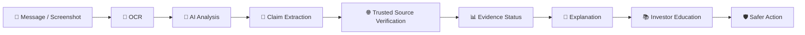
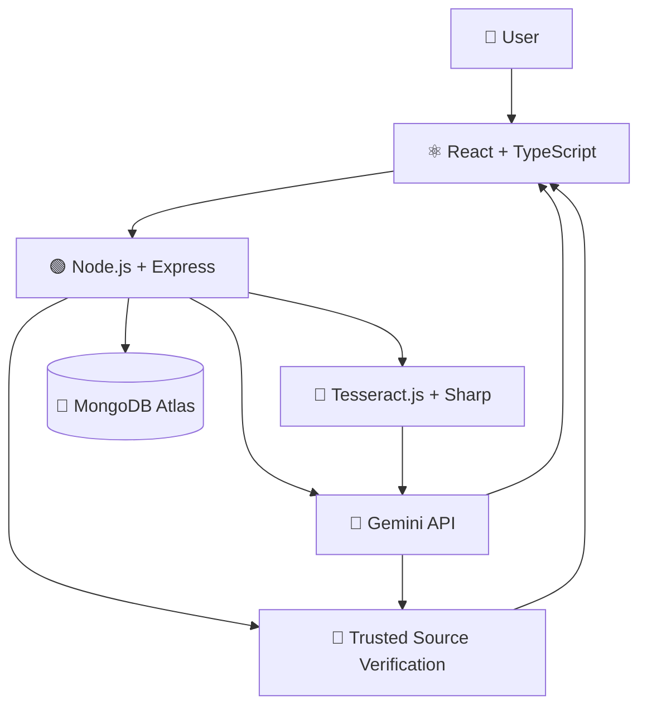

<div align="center">

# 🛡️ InvestorShield AI

### Detect. Verify. Understand. Invest Safer.

**A Bharat-first AI-powered investor safety and financial-content literacy platform.**

<br/>


<br/>

**[Features](#-key-features) · [Architecture](#-architecture) · [Setup](#-setup--installation) · [API Reference](#-api-reference)**

</div>

---

<br/>

InvestorShield AI is a working prototype developed for demonstrating an end-to-end investor safety workflow. The current implementation covers suspicious-content analysis, screenshot OCR, claim extraction, evidence-aware verification, investor education, and safety guidance.

InvestorShield AI focuses specifically on investor safety by combining suspicious-content detection, financial claim extraction, evidence-aware verification, explainable results, and investor education in a single workflow.

<div align="center">

> **InvestorShield AI helps everyday investors understand suspicious financial content before they act.**

`Detect → Verify → Explain → Educate → Safer Action`

</div>

---

## 🚀 Live Demo

**Frontend:** [https://investor-shield-ai.vercel.app](https://investor-shield-ai.vercel.app/)  
**Backend:** [https://investorshield-ai.onrender.com](https://investorshield-ai.onrender.com/)  
**GitHub:** [https://github.com/Devprasath17/InvestorShield-AI](https://github.com/Devprasath17/InvestorShield-AI)

---

## 🖼️ Product Preview

InvestorShield AI is implemented as a working prototype demonstrating the complete investor-safety workflow:
`Detect → Verify → Understand → Educate → Act Carefully`

*The screenshots below show the current working product interface and demonstrate the implemented analysis, verification, learning, and safety workflows.*

> **Product screenshots can be added to `docs/screenshots/` as the project demo assets are finalized.**

---

## 🚨 The Problem

Investors in Bharat are increasingly targeted with deceptive messages across WhatsApp, Telegram, and SMS. 

| Risk Signal | What Users May See |
| :--- | :--- |
| 💰 **Unrealistic Returns** | "₹10,000 → ₹50,000 in 15 days" |
| 🏛️ **Fake Authority** | "SEBI Approved Opportunity" |
| ⏰ **Urgency** | "Limited slots — act now" |
| 🔗 **Suspicious Links** | Unknown, APK, or shortened links |
| 💳 **Payment Pressure** | Immediate UPI/payment requests |
| 🔐 **Sensitive Information** | OTP / PIN / credentials requests |

> The challenge is not only identifying suspicious content. Users also need to understand **what they should verify before acting**.

---

## 💡 Our Solution

InvestorShield AI bridges the gap between complex financial regulations and the end user by offering a simple, verifiable diagnostic tool. 

Users can paste a suspicious message or upload a screenshot. The platform utilizes Optical Character Recognition (OCR) to extract the text, and leverages Google's Gemini AI to identify high-risk signals commonly associated with financial fraud.

Extracted claims are then dynamically verified against trusted sources using Google Search Grounding to check for real-world evidence. Finally, the user receives an evidence-aware result presented in plain language, paired with actionable safety habits.

---

# 🎯 Built for A + E + C

InvestorShield AI is strategically aligned with three core domains to create a holistic safety net through one workflow: `Detect → Verify → Understand → Educate → Act Carefully`.

| 🛡️ A | 🧠 E | 📚 C |
| :--- | :--- | :--- |
| **Digital Fraud & Scam Resilience** | **Misinformation & Financial Content Literacy** | **Investor Education for Bharat** |
| Identify suspicious investment content and high-risk signals before any money is transferred. | Understand and verify financial claims using trusted evidence and context. | Build safer financial habits through simple, accessible, vernacular-friendly education. |

---

## ✨ Key Features

### 🔍 Suspicious Content Analysis
Identify risk signals in investment-related messages and screenshots.

### 📸 Screenshot OCR
Extract text from uploaded screenshots using OCR.

### 🧠 AI-Powered Analysis
Analyze claims and explain potential risk indicators utilizing Gemini's advanced reasoning.

### 🔎 Evidence Verification
Verify relevant claims against available trusted sources.

### 📊 Evidence-Aware Results
Provide categorical results:
* ✅ Verified
* ⚠️ Needs Verification
* ❌ Contradicted
* ℹ️ No Evidence Found

### 📚 Investor Learning Hub
Search, filter, and explore practical investor-safety education.

### 🌐 Bharat-First Experience
Simple language, visual explanations, and English/Tamil support where implemented.

### 🛡️ Safety Guardrails
Designed explicitly without investment recommendations, stock tips, or buy/sell signals.

---

## ⚙️ Product Workflow



---

## 🛠️ How It Works

### 01 — Upload
User submits an investment-related message or screenshot.

### 02 — Extract
OCR extracts readable text from uploaded screenshots for further analysis.

### 03 — Detect
The AI system identifies suspicious signals (e.g., urgency) and extracts definitive financial claims.

### 04 — Verify
Evidence verification uses available trusted evidence, including validated official sources where applicable.

### 05 — Explain
The evidence result is presented in easily understandable, non-academic language.

### 06 — Educate
The user receives relevant, context-aware safety-learning content based on their specific risk indicators.

### 07 — Act Carefully
The platform encourages users to pause, independently verify important information, and act carefully before transferring money or sharing sensitive information.

---

# 🔐 Evidence-First Verification

We categorize claims into four strict evidence states to prevent false certainty:

| Status | Meaning |
| :--- | :--- |
| 🟢 **Verified** | Available evidence supports the claim. |
| 🔴 **Contradicted** | Available trusted evidence conflicts with the claim. |
| 🟡 **Needs Verification** | More verification is required to confirm the claim. |
| ⚪ **No Evidence Found** | No relevant evidence was found through the verification process. |

> ### ⚠️ No Evidence Found ≠ False
> Lack of available evidence does not automatically prove that a claim is false. It means the user should exercise extreme caution and seek alternative verification.

---

## 📚 Investor Safety Learning Hub

The platform includes an interactive educational repository:
* 🔎 **Real-time search**
* 🏷️ **Category filtering** 
* 🔗 **Learn More navigation** 
* 📖 **Detailed learning pages** 
* ✅ **Quick Safety Checklist** for practical verification.
* 🔄 **Related Topics** 
* 📱 **Responsive design** 
* 🌐 **English/Tamil educational content** where implemented.

```text
Learn → Check → Verify → Decide Carefully
```

---

## 🌐 Bharat-First Design

Designed with the Indian user in mind:
* English + Tamil support for educational content where implemented.
* Simple language focused on readability.
* Visual risk/status indicators (colors and icons) for low cognitive load.
* Accessible, responsive, and mobile-friendly interface.

---

## 🛡️ Safety Guardrails

**What InvestorShield AI does NOT do:**

* Does not provide investment advice
* Does not recommend stocks
* Does not provide buy/sell signals
* Does not manage portfolios
* Does not predict market prices
* Does not treat AI pattern detection as definitive proof of fraud
* Does not convert "No Evidence Found" into "False"
* Does not fabricate evidence
* Does not expose API keys

> **We help users understand what to verify — not what to invest in.**
> 
> **Human decision remains final.**

---

## 💻 Technology Stack

| Layer | Technology |
| :--- | :--- |
| **Frontend** | React, Vite, TypeScript |
| **Styling** | Tailwind CSS, Lucide Icons |
| **Backend** | Node.js, Express.js, TypeScript |
| **AI** | Google Gemini API |
| **OCR** | Tesseract.js |
| **Image Processing** | Sharp |
| **Uploads** | Multer |
| **Database** | MongoDB Atlas, Mongoose |

---

## 🏗️ Architecture



---

## 📂 Project Structure

```text
InvestorShield-AI/
├── client/                 # Frontend React Application
│   ├── src/
│   │   ├── components/     # Reusable UI components
│   │   ├── pages/          # Route pages (Home, Analyze, Learn, History, etc.)
│   │   ├── services/       # API integration
│   │   └── types/          # TypeScript definitions
│   └── package.json
├── server/                 # Backend Express API
│   ├── src/
│   │   ├── controllers/    # Route controllers
│   │   ├── middleware/     # Upload, rate limiting, and security
│   │   ├── prompts/        # AI prompts and logic
│   │   ├── routes/         # Express API routes
│   │   └── utils/          # Helpers and validation
│   └── package.json
└── README.md
```

---

## 🚀 Setup / Installation

### Prerequisites
* Node.js
* npm
* MongoDB Atlas Cluster (or local MongoDB)
* Google Gemini API Key

### Clone
```bash
git clone https://github.com/Devprasath17/InvestorShield-AI.git
cd InvestorShield-AI
```

### Install

**Backend:**
```bash
cd server
npm install
```

**Frontend:**
```bash
cd ../client
npm install
```

---

## 🔐 Environment Variables

**Server (`server/.env`):**
```env
PORT=
MONGODB_URI=
GEMINI_API_KEY=
CLIENT_URL=
```

**Client (`client/.env`):**
```env
VITE_API_URL=
```

---

## 🔌 API Reference

| Method | Endpoint | Purpose |
| :--- | :--- | :--- |
| `GET` | `/api/health` | Check backend health status. |
| `POST` | `/api/analyze/text` | Analyze raw text for risk signals and claims. |
| `POST` | `/api/analyze/image` | Extract text via OCR and analyze an uploaded image/screenshot. |
| `POST` | `/api/verify` | Verify extracted claims against trusted sources. |
| `GET` | `/api/education/topics` | Retrieve the curriculum of educational topics. |
| `GET` | `/api/history` | Retrieve the user's past analyses. |
| `POST` | `/api/history` | Save a new analysis history record. |
| `GET` | `/api/history/:id` | Retrieve a specific analysis record by ID. |
| `DELETE`| `/api/history/:id` | Delete a specific analysis record. |

---

## 🔒 Security

**Implemented Protections:**
* **Helmet**: Secure HTTP headers.
* **CORS**: Restricted origins.
* **Rate Limiting**: API rate limiting to prevent abuse.
* **Multer file-size validation**: Strict file size limits for image uploads.
* **Request Validation**: Strict JSON payload constraints.
* **Environment Variables**: API key protection.

---

## ⚠️ Limitations

* Evidence availability depends on accessible trusted sources.
* AI analysis can produce uncertain results and should not be treated as definitive proof of fraud.
* OCR quality depends on screenshot clarity.
* External AI/evidence services may occasionally be unavailable.
* InvestorShield AI does not replace official regulatory or legal verification.
* The system is not financial advice.

---

## 🗺️ Roadmap

### ✅ Current
* Scam/risk analysis
* Screenshot OCR
* Claim verification
* Evidence-aware results
* Investor Learning Hub
* English/Tamil educational content support

### 🔜 Next
* More regional Indian languages
* Expanded trusted-source integrations (Future versions can expand the range of trusted regulatory and institutional sources used for evidence verification)
* More financial scam patterns
* Improved web accessibility features
* Stronger low-bandwidth experience

---

## 🏆 Why This Matters

**Detect** → Recognize suspicious signals before acting.  
**Verify** → Check available evidence against emotional manipulation.  
**Understand** → Explain risk in simple, non-academic language.  
**Educate** → Build safer long-term financial habits.  
**Act Carefully** → Encourage users to pause and evaluate.  

---

<div align="center">

## 👥 Team

**Devprasath K K**  
**Ashwitha E**

</div>

---

> **Disclaimer:** InvestorShield AI is an educational and safety-support tool. It does not provide investment, legal, or financial advice and does not guarantee that any message, claim, or opportunity is legitimate or fraudulent. Users should independently verify important financial information through appropriate official and trusted sources before taking action.
