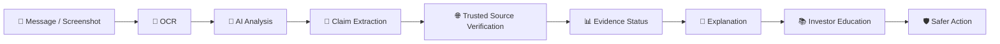
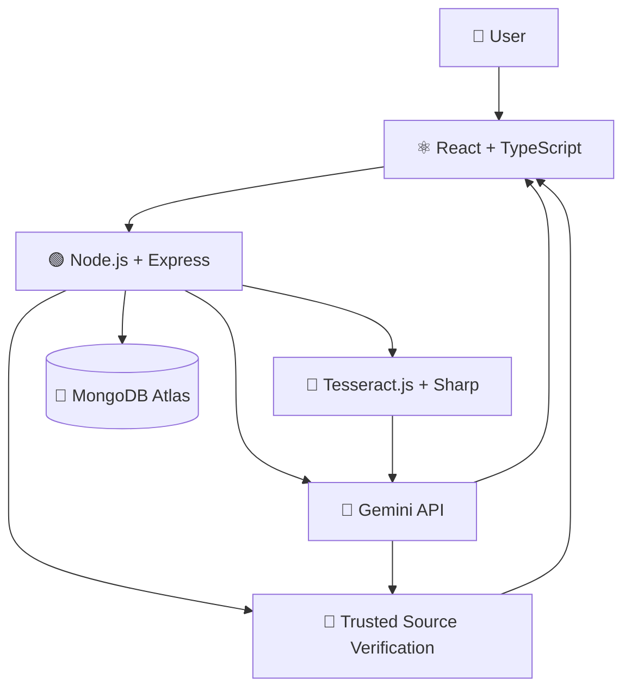

<div align="center">

# 🛡️ InvestorShield AI

### Detect. Verify. Understand. Invest Safer.

**A Bharat-first AI-powered investor safety and financial-content literacy platform.**

<br/>


<br/>

**[Features](#-key-features) · [Architecture](#-architecture) · [Setup](#-quick-start) · [API Reference](#-api-reference)**

</div>

---

<br/>

> **Product screenshots coming soon**

<br/>

<div align="center">

> **InvestorShield AI helps everyday investors understand suspicious financial content before they act.**

`Detect → Verify → Explain → Educate → Safer Action`

</div>

<br/>

## 🚨 The Problem

Investors in Bharat are increasingly targeted with deceptive messages across WhatsApp, Telegram, and SMS. 

| Risk Signal | What Users May See |
| :--- | :--- |
| 💰 **Unrealistic Returns** | "₹10,000 → ₹50,000 in 15 days" |
| 🏛️ **Fake Authority** | "SEBI Approved Opportunity" |
| ⏰ **Urgency** | "Limited slots — act now" |
| 🔗 **Suspicious Links** | Unknown, APK, or shortened links |
| 💳 **Payment Pressure** | Immediate UPI/payment requests |
| 🔐 **Sensitive Information** | OTP / PIN / credentials requests |

> The challenge is not only identifying suspicious content. Users also need to understand **what they should verify before acting**.

---

## 💡 Our Solution

InvestorShield AI bridges the gap between complex financial regulations and the end user by offering a simple, verifiable diagnostic tool. 

Users can paste a suspicious message or upload a screenshot. The platform utilizes advanced Optical Character Recognition (OCR) to extract the text, and leverages Google's Gemini AI to identify high-risk signals commonly associated with financial fraud.

Extracted claims are then dynamically verified against trusted sources using Google Search Grounding to check for real-world evidence. Finally, the user receives an evidence-aware result presented in plain language, paired with actionable safety habits.

<div align="center">

```text
📩 Message / Screenshot
        ↓
🔎 Detect
        ↓
🧠 Analyze
        ↓
🔐 Verify
        ↓
💬 Explain
        ↓
📚 Educate
        ↓
🛡️ Safer Action
```

</div>

---

# 🎯 Built for A + E + C

InvestorShield AI is strategically aligned with three core domains to create a holistic safety net:

| 🛡️ A | 🧠 E | 📚 C |
| :--- | :--- | :--- |
| **Digital Fraud & Scam Resilience** | **Misinformation & Financial Content Literacy** | **Investor Education for Bharat** |
| Identify suspicious investment content and high-risk signals before any money is transferred. | Understand and verify financial claims using trusted evidence and context. | Build safer financial habits through simple, accessible, vernacular-friendly education. |

---

## ✨ Key Features

### 🔍 Suspicious Content Analysis
Identify risk signals in investment-related messages and screenshots in seconds.

### 📸 Screenshot OCR
Extract text reliably from uploaded screenshots using Tesseract.js.

### 🧠 AI-Powered Analysis
Analyze claims and explain potential risk indicators utilizing Gemini's advanced reasoning.

### 🔎 Evidence Verification
Verify relevant claims against available trusted sources through Google Search Grounding.

### 📊 Evidence-Aware Results
Provide strict categorical results based on facts:
* ✅ Verified
* ⚠️ Needs Verification
* ❌ Contradicted
* ℹ️ No Evidence Found

### 📚 Investor Learning Hub
Search, filter, and explore practical investor-safety education.

### 🌐 Bharat-First Experience
Simple language, visual explanations, low cognitive load, and English/Tamil support.

### 🛡️ Safety Guardrails
Designed explicitly without investment recommendations, stock tips, or buy/sell signals.

---

## ⚙️ Product Workflow



---

## 🛠️ How It Works

### 01 — Upload
User submits an investment-related message or screenshot.

### 02 — Extract
OCR extracts readable content from the image, bypassing obfuscation attempts.

### 03 — Detect
The AI system identifies suspicious signals (e.g., urgency) and extracts definitive financial claims.

### 04 — Verify
Relevant claims are checked against available trusted evidence and official registries.

### 05 — Explain
The evidence result is presented in easily understandable, non-academic language.

### 06 — Educate
The user receives relevant, context-aware safety-learning content based on their specific risk indicators.

### 07 — Act Carefully
The platform encourages a 24-hour cooling period and independent verification before any action.

---

# 🔐 Evidence-First Verification

We categorize claims into four strict evidence states to prevent false certainty:

| Status | Meaning |
| :--- | :--- |
| 🟢 **Verified** | Available evidence supports the claim. |
| 🔴 **Contradicted** | Available trusted evidence conflicts with the claim. |
| 🟡 **Needs Verification** | More verification is required to confirm the claim. |
| ⚪ **No Evidence Found** | No relevant evidence was found through the verification process. |

> ### ⚠️ No Evidence Found ≠ False
> Lack of available evidence does not automatically prove that a claim is false. It means the user should exercise extreme caution and seek alternative verification.

---

## 📚 Investor Safety Learning Hub

The platform includes a fully functional, interactive educational repository:
* 🔎 **Real-time search** against topics and safety habits.
* 🏷️ **Category filtering** for targeted learning (e.g., High-Risk Signals).
* 🔗 **Learn More navigation** linking cards to deep-dive content.
* 📖 **Detailed learning pages** explaining "Why This Matters" and "What to Look For".
* ✅ **Quick Safety Checklist** for interactive diagnostics.
* 🔄 **Related Topics** to encourage endless learning.
* 📱 **Responsive design** optimized for all devices.

```text
Learn → Check → Verify → Decide Carefully
```

---

## 💻 Tech Stack

| Layer | Technology |
| :--- | :--- |
| **Frontend** | React 19, Vite, TypeScript |
| **Styling** | Tailwind CSS v4, Lucide Icons |
| **Backend** | Node.js, Express.js, TypeScript |
| **AI** | Google Gemini API (`@google/generative-ai`) |
| **OCR & Processing** | Tesseract.js, Sharp, Multer |
| **Database** | MongoDB Atlas, Mongoose |

---

## 🏗️ Architecture



---

## 📂 Project Structure

```text
InvestorShield-AI/
├── client/                 # Frontend React Application
│   ├── src/
│   │   ├── components/     # Reusable UI components
│   │   ├── pages/          # Route pages (Home, Analyze, Learn, History, etc.)
│   │   ├── services/       # API integration
│   │   └── types/          # TypeScript definitions
│   └── package.json
├── server/                 # Backend Express API
│   ├── src/
│   │   ├── controllers/    # Route controllers
│   │   ├── middleware/     # Upload, rate limiting, and security
│   │   ├── prompts/        # AI prompts and logic
│   │   ├── routes/         # Express API routes
│   │   └── utils/          # Helpers and validation
│   └── package.json
└── README.md
```

---

## 🚀 Quick Start

### Prerequisites
* Node.js (v18+)
* npm
* MongoDB Atlas Cluster (or local MongoDB)
* Google Gemini API Key

### Clone
```bash
git clone https://github.com/Devprasath17/InvestorShield-AI.git
cd InvestorShield-AI
```

### Install

**Backend:**
```bash
cd server
npm install
```

**Frontend:**
```bash
cd ../client
npm install
```

### Environment Variables

**Server (`server/.env`):**
```env
PORT=5000
MONGODB_URI=<your_mongodb_connection_string>
GEMINI_API_KEY=<your_gemini_api_key>
CLIENT_URL=http://localhost:5173
```

**Client (`client/.env`):**
```env
VITE_API_URL=http://localhost:5000
```

### Run

**Backend (from `/server`):**
```bash
npm run dev
```

**Frontend (from `/client`):**
```bash
npm run dev
```

---

## 🔌 API Reference

| Method | Endpoint | Purpose |
| :--- | :--- | :--- |
| `POST` | `/api/analyze/text` | Analyze raw text for risk signals and claims. |
| `POST` | `/api/analyze/image` | Extract text via OCR and analyze an uploaded image/screenshot. |
| `POST` | `/api/verify` | Verify extracted claims against trusted sources. |
| `GET` | `/api/education/topics` | Retrieve the curriculum of educational topics. |
| `GET` | `/api/history` | Retrieve the user's past analyses. |

---

# 🛡️ Security & Responsible AI

**Implemented Protections:**
* **Helmet**: Secure HTTP headers.
* **CORS**: Restricted origins.
* **Rate Limiting**: `express-rate-limit` prevents brute-force (100 req / 15 min).
* **Upload Limits**: Strict Multer payload constraints.
* **Input Validation**: Strict JSON payload constraints (100kb).
* **Environment Secrets**: API keys securely managed via `.env`.

### What InvestorShield AI Does NOT Do

❌ Investment advice  
❌ Stock tips  
❌ Buy/Sell recommendations  
❌ Portfolio management  
❌ Guaranteed financial outcomes  

> **We help users understand what to verify — not what to invest in.**

---

## ⚠️ Limitations

* AI can make mistakes or misinterpret complex financial nuance.
* Verification depends heavily on available trusted evidence and search indexing.
* **No Evidence Found does not mean False.**
* External AI/search services may experience downtime or rate limits.
* The platform is an educational diagnostic aid, not a certified financial advisory service.

---

## 🗺️ Roadmap

### ✅ Current
* Scam/risk analysis
* Screenshot OCR
* Claim verification
* Evidence-aware results
* Investor Learning Hub
* English/Tamil educational content support

### 🔜 Next
* More regional Indian languages
* Expanded trusted-source coverage (Direct MCA/SEBI API integrations)
* More financial scam patterns
* Improved web accessibility features
* Stronger low-bandwidth experience

---

## 🏆 Why This Matters

**Detect** → Recognize suspicious signals before acting.  
**Verify** → Check available evidence against emotional manipulation.  
**Understand** → Explain risk in simple, non-academic language.  
**Educate** → Build safer long-term financial habits.  
**Act Carefully** → Encourage users to pause and evaluate.  

---

<div align="center">

## 👥 Team

**Devprasath K K**  
**Ashwitha E**

</div>

---

> **Disclaimer:** InvestorShield AI is an educational and safety-support tool. It does not provide investment, legal, or financial advice and does not guarantee that any message, claim, or opportunity is legitimate or fraudulent. Users should independently verify important financial information through appropriate official and trusted sources before taking action.

<br/>

<div align="center">

### 🛡️ InvestorShield AI

**Detect. Verify. Understand. Invest Safer.**

Built to help people pause, verify, and understand before they act.

</div>
